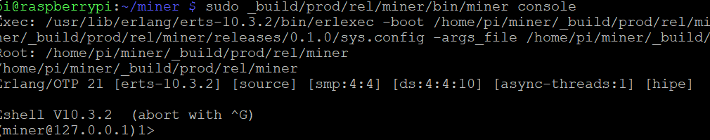
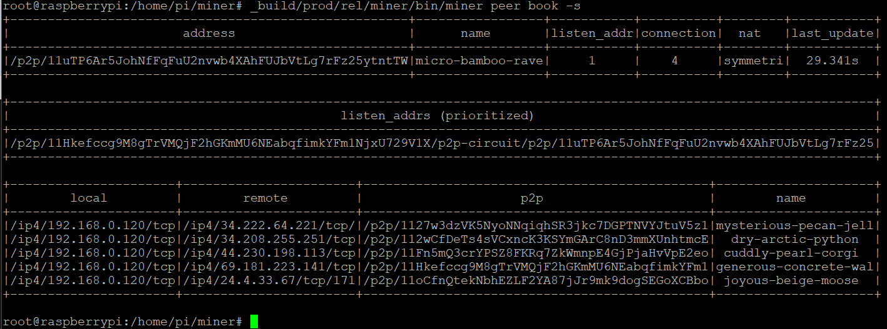
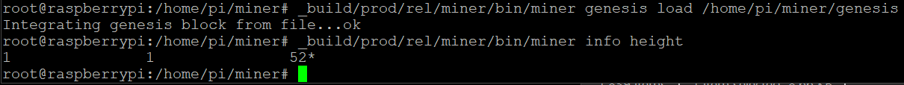

Building a Development Hotspot
=====================
----------------------

This guide walks through the steps required to build a Development Hotspot that can send and receive packets over the wireless network, but not perform any blockchain mining functions.

--------------

Download Raspbian Lite from <https://www.raspberrypi.org/downloads/raspbian/>

Current tested release is:

    Raspbian Buster Lite
    ====================
    Minimal image based on Debian Buster
    Version:September 2019
    Release date:2019-09-26
    Kernel version:4.19
    Size:435 MB

Using balena etcher (or whatever SD flashing tool you prefer), burn the Buster Lite image to a Micro SD card (64GB recommended, and remember, faster is better. Test your cards, kids!)

<https://www.balena.io/etcher/>

Once that completes without errors, we need to do a couple things. Etcher should have unmounted your card, so go ahead and eject that and reinsert. You will most likely see a series of popups from the OS telling you that you need to format/it can't read/etc... Close these all down.

If you are using Windows, you should see a "boot" partition that has auto-mounted.

Goto this partition and create a txt file with the following name (and no ".txt" extension):

    ssh

We now need to create another txt file with the following name "wpa_supplicant.conf"

Good. Now, in order to add the contents to this new file (that will allow us to connect to your local wifi network), we need to edit it with a program that does line-endings correctly (read: not notepad)

VS Code works well for this, as do many others.

Open the newly created config file, and enter the following (replacing the obvious):

    country=US
    ctrl_interface=DIR=/var/run/wpa_supplicant
    GROUP=netdev
    update_config=1
    network={
        ssid="your_real_wifi_ssid"
        psk="your_real_password"
    }

There are mechanisms to conceal the plaintext password here (search NTLM password hash), but that's outside the doc scope.

Alright... save that file down, and eject the card.

Now, understand that the two files we just created are only valid for the next boot, so make sure you have a decent power supply for the RPi (2.5A or better preferred), ensure your antenna is connected to your concentrator (and is sexed correctly), and power the thing up.

Give it just a bit to boot, then use an application such as "fing" <https://www.fing.com/products/fing-app> to discover the new device's IP address.

SIDENOTE:

If you are on a Windows box and would like to have read/write access to volumes on the SD card not natively available to you, there is a commercial utility available. They have a trial, but even afterwards, you may use it at a reduced data rate (which works for any purposes we have here) *insert standard "I don't have anything to do w/ them disclaimer here

<https://www.paragon-software.com/home/linuxfs-windows/>

This will allow you to access the rootfs partition:

And edit the wpa_supplicant.conf file

At this point, we should have the IP of the new RPi install, and can SSH in with the access we established.

Using Putty (or any other client you prefer) <https://www.chiark.greenend.org.uk/~sgtatham/putty/latest.html> ,

Connect to the RPi  on the IP address we located above (in the case of this example, 192.168.0.120)

![Machine generated alternative text:
PuTTY Configuration
Category:
Session
Logging
Terminal
Keyboard
Basic options for your PulTY session
Specify the destination you want to connect to
Host Name (or IP address)
0.1201
Connection type:
Port
22
Features
Window
Appearance
Behaviour
Translation
Selection
Colours
Connection
Data
Proxy
Telnet
Rlogin
SSH
Serial
About
O Raw Oleinet C) Rlogin @SSH C)
Load, save or delete a stored session
Saved Sessions
Default Settings
Close window on exit:
C) Always O
Never
Load
Save
@Only on clean exit
Help
Open
Cancel ](./img/pic07.png)

Accept the message:

![Machine generated alternative text:
PuTTY Security Alert
WARNING - POTENTIAL SECURITY BREACH!
The server's host key does not match the one PuTTY has
cached in the registry. This means that either the
server administrator has changed the host key, or you
have actually connected to another computer pretending
to be the server.
The new ssh-ed25519 key fingerprint is:
ssh-ed25519 256
If you were expecting this change and trust the new key,
hit Yes to update PuTTY's cache and continue connecting.
If you want to carry on connecting but without updating
the cache, hit No.
If you want to abandon the connection completely, hit
Cancel. Hitting Cancel is the ONLY guaranteed safe
choice.
Yes
No
Cancel
Help ](./img/pic08.png)

And enter "raspberry" for the password

![Machine generated alternative text:
pi@raspberrypi:
rsxng username "PI "
password:
linux raspberrypi 4.19.75---v7+ #1270 SMP Tue Sep 24 18:45:11 BST 2019 armv71
'he programs included with the Debian GNU/Linux system are free software;
he exact distribution terms for each program are described in the
.ndividual files in /usr/ share/ doc/*/copyright.
)ebian GNU/ Linux comes with ABSOLUTELY NO WARRANTY, to the extent
»ermitted by applicable law.
iSH is enabled and the default password for the 'pi' user has not been changed.
'his is a security risk --- please login as the 'pi' user and type 'passwd' to set
a new password. ](./img/pic09.png)

The default Raspian image has a small swapfile of 100MB, which on a Pi with 1GB or less of RAM is insufficient for building some of the dependencies, such as [RocksDB](http://rocksdb.org/). To increase the swap size, first stop the swap:

    sudo dphys-swapfile swapoff

Edit the swapfile configuration as root

    sudo nano /etc/dphys-swapfile

and change the CONF_SWAPSIZE:

    CONF_SWAPSIZE=1024

Save the file (ctrl-x), then reboot:

    sudo reboot

Next, enable SPI and I2C by running

    sudo raspi-config

and selecting Interfacing Options. Enable I2C and SPI from within the menu system. (also change your password, keyboard setup, etc at this point)

Let's go ahead and update our install with:

    sudo apt-get update

First, you'll need [git](https://git-scm.com/). If you don't have it installed:

    sudo apt-get install git

Clone the git repository:

    git clone https://github.com/helium/miner.git

You will need to install the dependencies listed below in order to use the Miner.

INSTALL ERLANG
-------------------
-------------------

Miner has been tested against Erlang OTP 21.3.

To install OTP 21.3 in Raspbian, we'll first acquire the Erlang package from Erlang Solutions and then install the dependencies: 

(expect errors after the second command here... that's why we use the force in the third)

    wget https://packages.erlang-solutions.com/erlang/debian/pool/esl-erlang_21.3.3-1~raspbian~stretch_armhf.deb

    sudo dpkg -i esl-erlang_21.3.3-1~raspbian~stretch_armhf.deb

    sudo apt-get install -f

Install various other dependencies: 

(if you get a failure here, try it again. Dealing with mirrors is sometimes unreliable)

    sudo apt-get install libdbus-1-dev autoconf automake libtool flex libgmp-dev cmake libsodium-dev libssl-dev bison libsnappy-dev libclang-dev doxygen

We are also going to install screen to simplify things a bit later.

    sudo apt-get install screen

COMPILE THE MINER
---------------
---------------

Once the Miner has been cloned and Erlang installed, we can create a release using rebar3. Rebar will handle all the Erlang dependencies and build the application.

Before we can do this, however, we need to set up some keys for GitHub.

Paste the text below, substituting in your GitHub email address.

    ssh-keygen -t rsa -b 4096 -C "your_email@example.com"

This creates a new ssh key, using the provided email as a label.

When you're prompted to "Enter a file in which to save the key," press Enter. This accepts the default file location.

![Machine generated alternative text:
ssh---keygen ---t rsa ---b 4096 ---C
Generating public/private rsa key pair .
Enter file in which to save the key (/home/pi/ . ssh/id rsa) :
Enter passphrase (empty for no passphrase) :
Enter same passphrase again:
Your identification has been saved /home/pi/ .ssh/id rsa.
Your public key has been saved in /dcme/pi/ . ssh/id rsa . pub.
The key fingerprint is:
SHA256: lnPuhvLSUpMAk1J12YT2/10
The key's randomart image is:
-[RSA 4096]-
| .0.0.0+...
@gmail . co
@gmail . com ](./img/pic10.png)

Ensure the ssh-agent is running:

    eval $(ssh-agent -s)

Add your SSH private key to the ssh-agent.

    ssh-add ~/.ssh/id_rsa

Then go ahead and add this to your GitHub account:

<https://help.github.com/en/github/authenticating-to-github/adding-a-new-ssh-key-to-your-github-account>

Copy your key from:

    ~/.ssh/id_rsa.pub

And go put it into GitHub:

Click this button and add the key you just generated:

Use the following to test your SSH connection to GitHub:

    ssh -T git@github.com

Go into rebar.config and change the blockchain-core over from git to https (should look like this):

    {deps, [{blockchain, {git, "<https://github.com/helium/blockchain-core.git>",{branch, "master"}}},{hbbft, {git, "<https://github.com/helium/erlang-hbbft.git>", {branch, "master"}}},{dkg, {git, "<https://github.com/helium/erlang-dkg.git>", {branch, "master"}}},{ecc508, {git, "<https://github.com/helium/ecc508.git>", {branch, "master"}}},{ebus, {git, "<https://github.com/helium/ebus.git>", {branch, "master"}}},{helium_proto, ".*", {git, "<https://github.com/helium/proto.git>", {branch, "master"}}},recon]}.

Now we need to change the repo we are using for rocksdb...

    cd miner

    nano rebar.lock

Ctrl-w ( find/where) rocksdb

Change the repo and SHA over to the following:

    {<<"rocksdb">>,{git,"https://github.com/amirhaleem/erlang-rocksdb",{ref,"9f29d6e20d7f4f93a6157730a11fa9211e670e87"}},3},

After all of this, you should be able to run the following and build:
(this will take a while, and just ignore warnings)

    cd miner
    ./rebar3 as prod release

Once this completes, you're ready to run the Miner.

Using the Miner
-----------------------------
-----------------------------

Congrats! You've installed the Miner 🚀 Now it's time to make some things happen.

EDITING THE CONFIGURATION
---------------------------
---------------------------

The sys.config will need to be edited to match your configuration. Assuming you aren't using Helium Hotspot hardware you'll need to change the following lines of the configuration file:

    nano _build/prod/rel/miner/releases/0.1.0/sys.config

Change the following settings:

    {key, {ecc, [{key_slot, 0}, {onboarding_key_slot, 15}]}}, %% don't make this the last line in the stanza because sed and keep it on one line

should be changed to:

    {key, undefined}
    
and:

    {use_ebus, true}

should be changed to:

    {use_ebus, false}

You should also edit log_root, base_dir and update_dir to be appropriate for whatever you prefer on your system.

STARTING UP
-------------------
-------------------

We are now going to make use of screen (some shortcuts here <http://www.pixelbeat.org/lkdb/screen.html> ) that we installed earlier.

    sudo  su
    screen

Start new screens with Ctrl-a c

Then, we can simply use Ctrl-a (0-9) to switch or Ctrl-a n for next

Ctrl-a ESC to use the pg keys

You can run the Miner in the background, or via an interactive console.

To run in the background:

    _build/prod/rel/miner/bin/miner start

To run via the interactive console:

    _build/prod/rel/miner/bin/miner console
(If you run in console mode, you'll need to open another terminal to execute any other commands. use screen)

CHECKING THE PEER-TO-PEER NETWORK
---------------------
---------------------

The Helium blockchain uses an Erlang implementation of libp2p. Because we expect Hotspot hardware to be installed in a wide variety of networking environments erlang-libp2p includes a number of additions to the core specification that provides support for NAT detection, proxying and relaying.

The first order of business once the Miner is running is to see if you're connected to any peers, whether your NAT type has been correctly identified, and that you have some listen addresses:

    _build/prod/rel/miner/bin/miner peer book -s

As long as you have an address listed in listen_addrs and some peers in the table at the bottom, you're connected to the p2p network and good to go.

LOADING THE GENESIS BLOCK
------------------
------------------

First, you need a genesis block from either the main network, or the Pescadero testnet. Get them here: [mainnet](https://github.com/helium/blockchain-api/blob/master/priv/prod/genesis) or [pescadero](https://github.com/helium/blockchain-api/blob/master/priv/pescadero/genesis).

NOTE: those are not links to the actual files!

You need to hit the links, download the files, and then transfer those over to the  RPi.

Once you've downloaded it, you'll need to use the CLI to load the genesis block in to your local miner:
(use a fully qualified address)

    _build/prod/rel/miner/bin/miner genesis load <path_to_genesis>

After the genesis block has been loaded, you should be able to check your block height and see at least the genesis block:

    _build/prod/rel/miner/bin/miner info height

The first number is the election epoch, and the second number is the block height of your miner.

Installing concentrate from Source
---------------------
---------------------
Once you have miner running, you'll need concentrate to receive packets via SPI and the RAK2245 board and deliver them to the miner via UDP.

Clone the git repository:

    git clone https://github.com/helium/concentrate.git

You will need to install the dependencies listed below in order to use the Miner.

INSTALL RUST
-----------------
First, rustup must be installed, which can be done as follows:

    curl --proto '=https' --tlsv1.2 -sSf https://sh.rustup.rs | sh

    source $HOME/.cargo/env

Now, let's also install the following to keep the compilation from blowing up:

    sudo apt-get install llvm
    sudo apt-get install clang

COMPILE CONCENTRATE
------------------
Once you have concentrate and rustup installed, we can use Rust's package manager, Cargo, to build the concentrate application:

    cd concentrate
    git submodule update --init
    cargo build --features "sx1301"

Once complete, you're ready to run concentrate.

USING CONCENTRATE
------------------
Start up concentrate and the longfi protocol wrapper by running:

    ./target/debug/concentrate serve &
    ./target/debug/concentrate longfi &

If you want to be able to see pretty printed packets in the console you can instead use:

    ./target/debug/concentrate serve -p
    ./target/debug/concentrate longfi &

You'll see output that looks something like this any time a packet is received:

    received RxPacketLoRa { freq: 920600000, if_chain: 2, crc_check: Fail, timestamp: 2778.214131s, radio: R1, bandwidth: BW125kHz, spreading: SF7, coderate: 4/8, rssi: -117.0, snr: -11.5, snr_min: -15.0, snr_max: -8.0, crc: 4, payload: [225, 77, 252, 10, 79, 252, 5, 184, 159] }

---------------
Conclusion
----------------

That's it! Once you have miner and concentrate running you've built a Development Hotspot that can send and receive LongFi packets, and interact with the blockchain to deliver packets to their correct destination.

-------------------------

Startup
-------------------------
-------------------------
Alright, so... everything should be set up now. The following is a very rough walkthrough of the commands in the init process:

    sudo su
    screen

Ctrl-a c

Ctrl-a c

Ctrl-a c

Ctrl-a 0

    cd concentrate
    ./reset831.sh 17
    cd ..
    cd miner

    _build/prod/rel/miner/bin/miner console

Ctrl-a 1

    cd miner

    _build/prod/rel/miner/bin/miner peer book -s

    _build/prod/rel/miner/bin/miner info height

Ctrl-a 2

    cd concentrate

    ./target/debug/concentrate serve -p

Ctrl-a 3

    cd concentrate

    ./target/debug/concentrate longfi &

